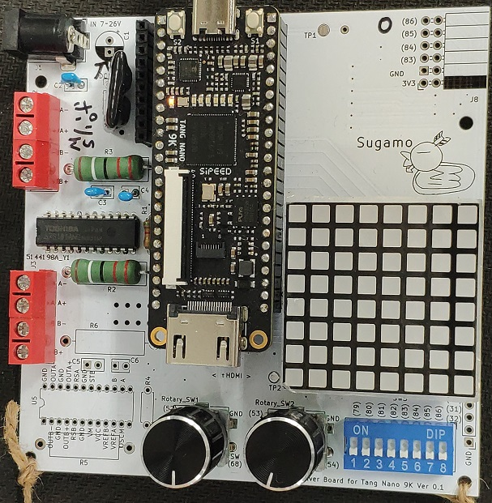
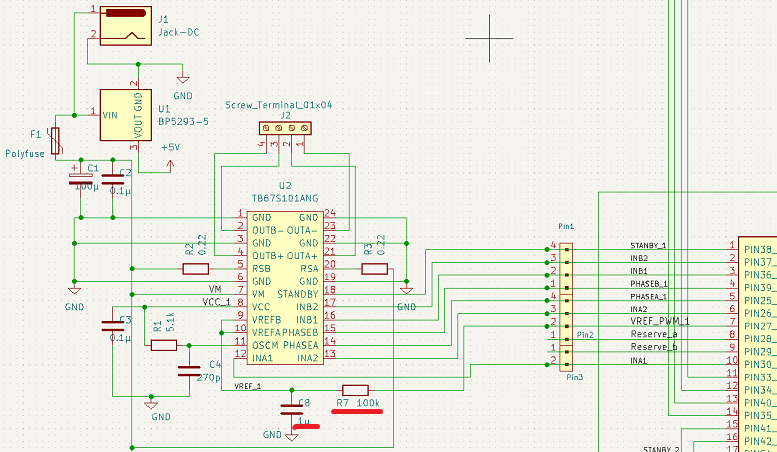

# TangNano9K_Motordriver Board
  
Tang Nano 9K(Sipeed)用のマザーボード（拡張ボード）です．  
This is mother board for Tang Nano 9K(Sipeed).  

  
  
オープンソースの回路CADである，KiCAD のプロジェクトになっています．  
These files were made by KiCAD.
  
/doc ドキュメント用の素材  
/output　KiCADで出力したガーバーデータ  
/output/tangnano9k_motordriver-v3.zip　　PCBメーカにアップロードするファイル  
/sampleProject　この基板向けの数種類のサンプルプロジェクト  

  
## 機能 Functions
次の機能を実装できます．
- ステッピングモータドライバ x2ch <TB67S101ANG(TOSHIBA)>
- ロータリエンコーダ x2
- 8x8 マトリクスLED <OSL641501-BRA(Optsupply)>
- 7セグメントLED
- DIP Switch(8ch)

You can install these functions with this board.
- Stepper motor driver x2ch
- Rotary encoder x2
- 8x8 Matrix LED
- 7segment LED
- DIP Switch(8ch)

## 電源 Power supply
ボード上にDC-DCコンバータBP5293-50(ROHM)を実装できます．  
DC-DCコンバータには7～26Vを入力し，出力される5VをTang Nano 9Kへ供給できます．  
DC-DC converter can be installed on the board.  
  
基板上のDCジャックへ入力された電圧は，上記DC-DCコンバータとモータドライバICのモータ電源（VM）へ入力されます．  
 
## FPGA側のピンを共用する機能 Multi purpose pins for board functions
　FPGAのピン数が限られているので，拡張ボードの持つ機能のうち，一部の機能は同時利用はできません．  
   
### HDMIコネクタとマトリクスLED＆ロータリエンコーダ×2
　DVI信号を出力する場合， `HDMI_CK_N(68)` ， `HDMI_CK_P(69)` ， `HDMI_D0` ～ `HDMI_D2` など8本の信号を使います．これらは，ロータリエンコーダ2ch目とマトリクスLEDの信号と競合します．従ってDVI出力する場合は，ロータリエンコーダの2ch目とマトリクスLEDが使えません．  
  ボードにマトリクスLEDを実装するときは，必要に応じて脱着できるようにピンソケット経由にするのがお勧めです． 

### HDMIコネクタとマトリクスLED
　一部の信号を共有しています．HDMIコネクタから信号を出す場合はマトリクスLEDを取り付けない方がよいでしょう．  
 マトリクスLEDを実装するときは，ピンソケットを介して取り付けるのがお勧めです．そうすれば，マトリクスLEDを必要に応じて脱着できます．  
  
### 排他利用する機能の選択 Selection of exclusive functions
　モータドライバの励磁モード選択は `INA1` ， `INA2` ， `INB1` ， `INB2` 端子で行います．  
　2CH目（基板下側）のモータドライバは，ソルダジャンパ `JP1～JP4` をショートすると， `INA1～INB2` の全てがVCCに接続され，励磁モードが2相励磁に固定されます（この場合， `JP5～JP8` はオープンのままにする）．   
 　2ch目のモータドライバで1-2相励磁やW1-2相励磁を行いたい場合，ソルダジャンパ `JP5～JP8` をショートさせます．すると `INA1～INB2` がFPGAに接続されるので，FPGAからHi/Lowを制御できます．  
  　ちなみに1ch目のモータドライバについては，このようなソルダジャンパはありません． `INA1～INB2` は全てFPGAに直結されているので，どの様な励磁モードを使う場合でも，FPGAから制御する必要があります．  
  
  FPGA側では，これらの端子をロータリエンコーダの2ch目と共有しています．  
  従って，モータドライバの2ch目の1-2相励磁選択と，ロータリエンコーダの2ch目は排他利用となります．  
#### 設定例
　①例えば，モータドライバを1chしか使わない場合は， `JP1～JP8` のソルダジャンパをオープンのまま使用します（7セグLEDを使うなら `JP9` のみショートする）．  
 　②例えば，モータドライバの2ch目を1-2相励磁（あるいはW1-2相励磁）で使いたい場合は， `JP5～JP8` のソルダジャンパをショートします（ `INA1～INB2` がFPGAと直結される）．  
  この場合7セグLEDとロータリエンコーダの2ch目は使用できません（実装もしない方がよいでしょう）．  

  

- JP1 ～ JP4　　ショートさせるとINA1～INB2をTB67S101ANGのVCCピンと接続
- JP5 ～ JP8　　ショートさせるとFPGAとINA1～INB2を接続
- JP9　　JP5の線を7セグLEDのコモンに接続
- JP10 ～ JP17　　マトリクスLEDに（アノード側）電流制限抵抗を付けない場合は，これらのソルダージャンパをショートさせてください  

## マトリクスLED MatrixLED
　~増幅回路も電流制限抵抗も入れていません．~  
　~ワイルドだろぅ？~  
  電流制限抵抗を入れない場合は，ソルダージャンパ `JP10` ～ `JP17` をジャンパします．
　必要であれば，FPGA側のロジックで絞ってください．  
　特に絞らずに使っていますが，LEDもFPGAも壊れないようです．  
  
  電流制限抵抗を入れる場合は，ソルダージャンパ `JP10` ～ `JP17` はオープンなまま抵抗器を実装します．  
トランジスタなどのパターンは基板にありません．電流を増幅せずに，真面目に計算して電流制限抵抗を入れると，LEDがかなり暗くなるようです．  

### マトリクスLED取り付け向き
  

   
## 部品
　思いつく限り列挙．抜けがあるかもしれない．  
 ロータリエンコーダのみ，押しスイッチ付きのものが秋月さんに見当たらなかったので，リストに入っていません．  
 基板の4角には穴が開いています．足としてM3程度のボルト・ナットを用意するとよいでしょう．M3だときついのですが，ねじ込めば入ります．  
 （モータドライブ回路用の部品は1ch分の数量を掲載している）
　ちなみに，秋月さんの店頭に出ていない部品もあります（モータドライバなどは，裏オプションなので，お店の人に言うと裏から出してくれます）．
   
 
 
## 機能の補足 Additional for Functions
### モータドライバTB67S101ANG（TOSHIBA）
　このICへ電流制御用のレファレンス電圧を供給する必要があります．Pinは `VREFA` 及び `VREFB` です．このボードでは `VREFA` と `VREFB` は直結されています．これらとFPGAの `27` （モータドライバch1）が接続されています．FPGAからパルスのデューティで所望の電圧を送って下さい．電圧の平滑化のために，RCフィルタのパターンが実装されています．R7とC8（モータドライバch1）に適当な値のものを実装してください．  
 （RCは，1μFと100kオーム．duty3/8くらいから試してください）  
  
  
   
   
   
## サンプルプログラム
   
### PolyphonyMatrix_Clock
`/sampleProject`にマトリクスLEDを使った時計のプロジェクトが入っています．  
このプロジェクトはPythonベースの高位合成ツールPolyphonyを利用しています．  
　Gowin EDAのプロジェクトになっているので，そのままGowin EDAで読み込めます．impl/pnr/にビットストリームファイルもあるので，合成しなくてもすぐにFlash Programmerで書き込めます．  
 Verilogファイル `LEDMatrixAB_m.v` は，Polyphonyで `LEDMatrix.py` をコンパイルして生成したものです．
 
### MotorDriver
 モータドライバ IC TB67S101ANG(TOSHIBA) を使ってステッピングモータの2相励磁，1－2相励磁，W1-2相励磁ができます． 
 このサンプルプログラムでは，DVI出力もしています．ピンが競合するのでマトリクスLEDは取り外してください．  
#### DVI出力
　DVI出力については，Interface誌2022年12月号　別冊付録Gowin　の応用編第3章の記事で紹介されたデザインをパクり，一部を改変しています（SPDXライセンス）．  
  
  
### Parallel
　回路を複数のモジュールに分けて並列に実行させるサンプルです．3つのLEDを3つの回路で点滅させています．  
  
 （1）TB67S101ANGデータシート  
 https://toshiba.semicon-storage.com/jp/semiconductor/product/motor-driver-ics/stepping-motor-driver-ics/detail.TB67S101ANG.html

# Schematics
https://kicanvas.org/?github=https%3A%2F%2Fgithub.com%2FLathe-Mariel%2FTangNano9K_motordriver%2Ftree%2Fmain
